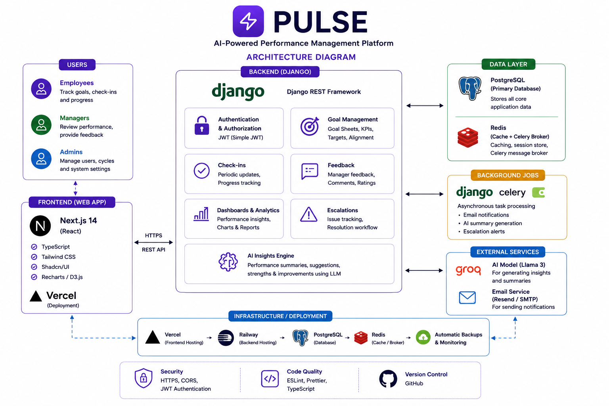

# Pulse ⚡

### AI-Powered Performance Management Platform

Pulse is a full-stack, goal-setting and performance management platform. Built to move organizations away from fragmented spreadsheets, Pulse provides structured workflows for tracking Key Performance Indicators (KPIs), enforcing quarterly check-ins, and aligning individual objectives with company-wide goals.

By integrating LLM capabilities, Pulse automates the heavy lifting of drafting feedback and ensuring goals follow the SMART (Specific, Measurable, Achievable, Relevant, Time-bound) framework.

---

## 🚀 Live Demo & Links

> **⚠️ Note:** This application is currently a **demo/portfolio project**. The live environment is populated with mock data for demonstration purposes.

*   **Frontend (Next.js):**https://pulse-three-mocha.vercel.app/login
*   **Backend API (Django):** https://pulse-production-2b9e.up.railway.app
*   **Repository:** https://github.com/Pihujalan/pulse

---

## 📌 Problem Statement

Traditional performance management relies on manual review cycles that suffer from:
*   **Misalignment:** Employees lose sight of how their work impacts broader company goals.
*   **Vague Objectives:** Goals lack proper metrics, weighting, and clear definitions.
*   **Feedback Delays:** Reviews only happen annually, missing crucial intervention windows.
*   **Administrative Overhead:** HR and managers spend hours tracking down updates and writing feedback.

**Pulse** solves this by strictly enforcing goal weightings, opening automated quarterly check-in windows, and providing managers with AI-drafted feedback based on calculated performance variances.

---

## ✨ Key Features & Business Logic

### 🎯 Goal Management & Validation
*   **Strict Weighting Rules:** Validates a maximum of 8 goals per employee per cycle, with a minimum 10% weightage per goal. Total must equal exactly 100%.
*   **Immutable State:** Goal sheets are locked upon approval via Django signals. Any state change triggers a record in an immutable `AuditLog`.
*   **Dynamic UoM Scoring:** Custom `ProgressCalculator` handles complex achievement formulas, including ZERO UoM (where 0 = 100% score) and MAX UoM (where lower is better).

### 🤖 AI Insights Engine (Groq Llama 3)
*   **SMART Goal Formulation:** Users draft a rough goal title and the AI engine suggests 2-3 SMART reformulations with recommended Units of Measure.
*   **Contextual Feedback Drafting:** When managers review quarterly check-ins, the AI analyzes planned vs. actual achievements to pre-fill professionally written, constructive feedback comments. Responses are cached in Redis to optimize API usage.

### 📊 Alignment & Analytics
*   **D3.js Force-Graph:** Visualizes cross-team shared goals and dependencies using a dynamic alignment map.
*   **Manager & Admin Dashboards:** Provides team check-in matrices, escalation tracking, and real-time performance analytics built with Recharts.
*   **Automated Exports:** Generates comprehensive CSV/Excel achievement reports utilizing Pandas and Openpyxl.

### 📅 Cycle & Check-in Enforcement
*   **Quarterly Windows:** The `QuarterWindow` model securely enforces when check-ins can be submitted, preventing out-of-cycle edits.

---

## 🏗 System Architecture



---


## 🛠 Tech Stack

### Frontend Client
*   **Framework:** Next.js 14 (App Router)
*   **Language:** TypeScript
*   **UI & Styling:** Tailwind CSS, Shadcn UI
*   **Data Visualization:** Recharts, D3.js v7

### Backend API
*   **Framework:** Django 4.2 & Django REST Framework
*   **Authentication:** SimpleJWT (JSON Web Tokens)
*   **Core Libraries:** Pandas, Openpyxl

### Data & Background Processing
*   **Database:** PostgreSQL 15
*   **Cache & Message Broker:** Redis 7
*   **Task Queue:** Celery & Django-Celery-Beat

### AI & Infrastructure
*   **LLM Provider:** Groq API (`llama-3.3-70b-versatile`)
*   **Containerization:** Docker & Docker Compose
*   **Deployment:** Railway (Backend) / Vercel (Frontend)

---

## ⚙️ Local Setup (Docker Recommended)

### Prerequisites
*   Docker Desktop installed and running.

### 1. Clone & Configure
```bash
git clone https://github.com/Pihujalan/pulse.git
cd pulse
cp .env.example .env
```
*(The `.env.example` includes a pre-filled Groq API key for immediate testing)*

### 2. Start Services
```bash
docker-compose up --build
```
This boots up PostgreSQL, Redis, the Django API (port 8000), Celery workers, and the Next.js frontend (port 3000).

### 3. Run Migrations & Seed Data
In a separate terminal, apply migrations and generate the demo environment (7 users with a full workflow history):
```bash
docker-compose exec backend python manage.py migrate
docker-compose exec backend python scripts/seed.py
```

---

## 👤 Demo Accounts

The seed script creates a fully populated environment with the Q2 check-in window OPEN. You can test different role perspectives using:

| Role | Email | Password | Context |
|------|-------|----------|---------|
| **Admin/HR** | `admin@pulse.demo` | `pulse123` | Full system access, cycle management, and audit logs |
| **Manager** | `manager@pulse.demo` | `pulse123` | Rahul Mehta (Sales) — Approving goals & drafting AI feedback |
| **Employee** | `employee@pulse.demo` | `pulse123` | Aditya Kumar — Sheet approved, ready for Q2 check-in |

---

## 🔮 Future Enhancements

*   **Real-time Collaboration:** WebSockets for live comments on goal sheets.
*   **Predictive Analytics:** Forecasting end-of-year performance based on Q1/Q2 velocity.
*   **Integrations:** Slack/MS Teams bots for check-in reminders and quick updates.
*   **Mobile Support:** Progressive Web App (PWA) optimization for on-the-go managers.

---

## 👩‍💻 Author

**Pihu Jalan**  
*BTech Computer Science*

GitHub: [github.com/Pihujalan](https://github.com/Pihujalan)
